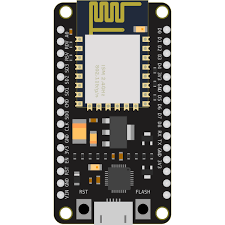
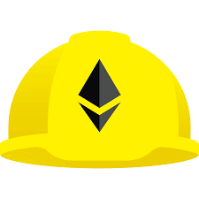

# Hi  My name is **Sandeep Prajapati** 

### Fullstack Web Developer || AI/ML Developer || Web 3 Developer || Embedded System Developer
---

Just completed **3.5 years** in my coding journey 🚀

* 🌍  I'm based in **Uttar Pradesh, India**
* ✉️  You can contact me at [6392424180sandeep@gmail.com](mailto:6392424180sandeep@gmail.com)
* 🧠  Currently learning **IoT**, **Machine Learning**, **Deep Learning**, **Reinforcement Learning**, **Generative AI**, **Transfer Learning**, **DevOps**, and **Basic Ethical Hacking**
* 🤝  Open to collaborating on anything related to **Web Applications**, **IoT**, **Machine Learning**, and **Deep Learning**,
* 👥  Looking for friends interested in **AI/ML**, **DevOps**, **IoT**, and **Web Development**

---

## My Experience in Following Technologies:

### 🌐 Web Development
| Technology          | Icon                               |
|---------------------|------------------------------------|
| **HTML**            |  |
| **CSS**             |  |
| **Bootstrap**       |  |
| **jQuery**          |  |
| **JavaScript**      |  |
| **PHP**             |  |
| **Laravel**         |  |
| **Django**          |  |
| **Node.js**         |  |
| **Express.js**      |  |
| **React.js**        |  |

### 🛠️ Programming and Scripting
| Technology          | Icon                               |
|---------------------|------------------------------------|
| **C**               |  |
| **C++**             |  |
| **Bash Scripting**  |  |
| **Batch Scripting** |  |

### 📊 Data Science and AI/ML
| Technology          | Icon                               |
|---------------------|------------------------------------|
| **Python**          |  |
| **NumPy**           |  |
| **Pandas**          |  |
| **PyTorch**         |  |
| **Scikit-Learn**    |  |
| **OpenCV**          |  |

### 📦 DevOps and Cloud
| Technology          | Icon                               |
|---------------------|------------------------------------|
| **Docker**          |  |
| **Git**             |  |
| **GitHub**          |  |
| **Heroku**          |  |

### 🖥️ Embedded Systems
| Technology          | Icon                               |
|---------------------|------------------------------------|
| **Arduino**         |  |
| **ESP8266**         |  |

### 🏗️ Blockchain
| Technology          | Icon                               |
|---------------------|------------------------------------|
| **Solidity**        |  |
| **Hardhat**         |  |
| **Ether.js**        |  |

### 🖥️ Operating Systems
| Technology          | Icon                               |
|---------------------|------------------------------------|
| **Linux**           |  |
| **Ubuntu**          |  |
| **Window**          |  |
| **Android**          |  |

---

## 🚀 Profile Features

### 🌟 Profile Visits

### 📊 GitHub Stats
- 

